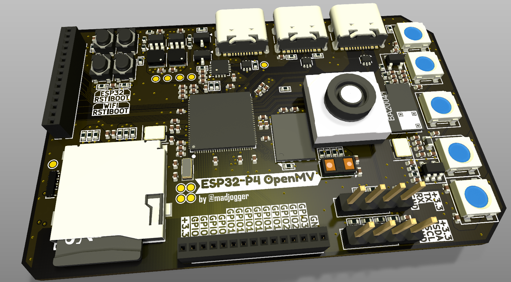
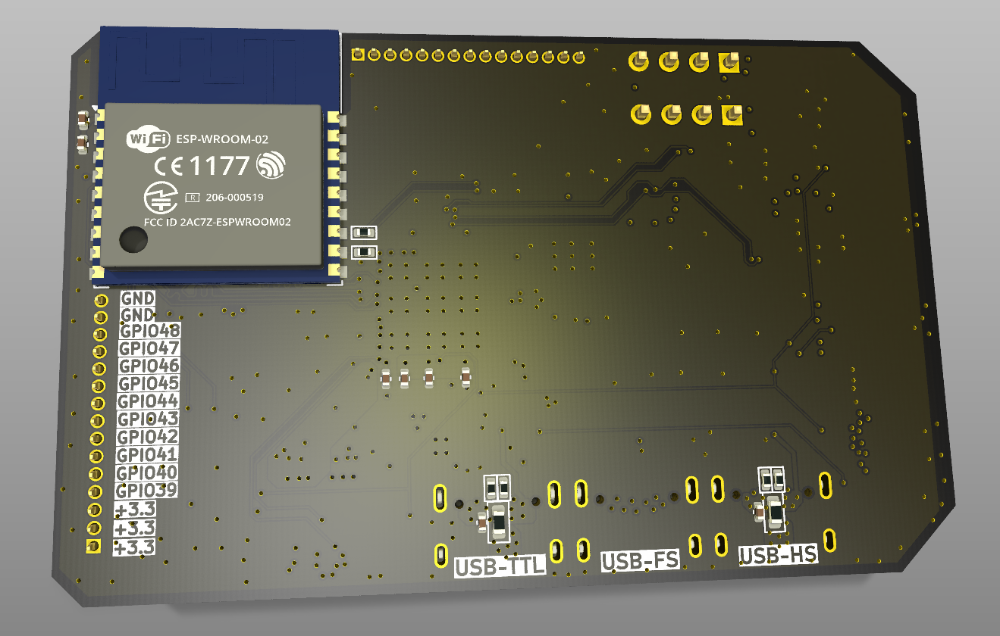
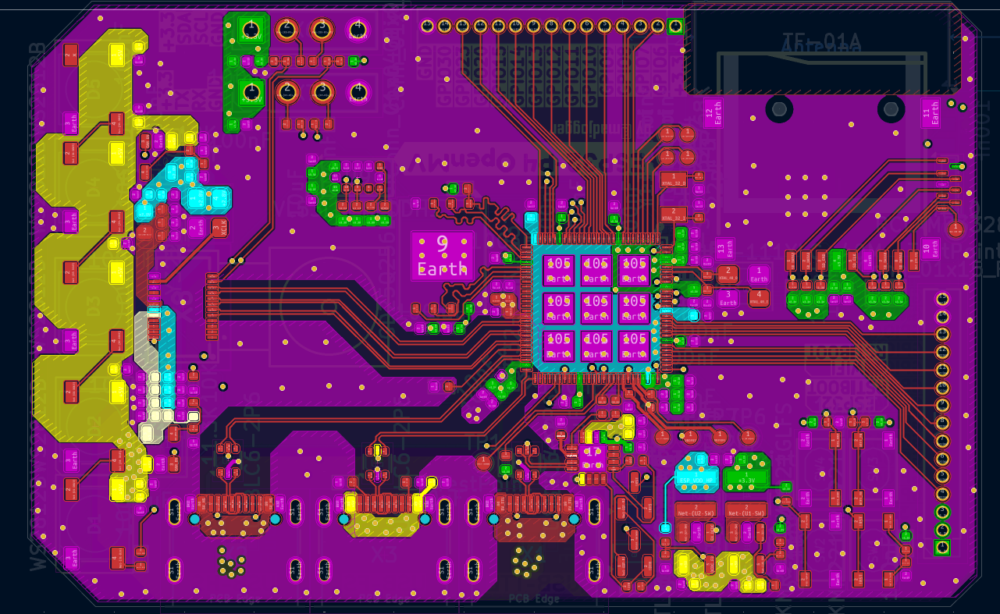

# ESP32-P4-dev-board

> High-performance vision and control board based on **ESP32-P4 (32 MB internal RAM)**.  
> Designed as a modern replacement for **OpenMV-style boards** built on STM32H7,  
> with integrated USB interfaces, Wi-Fi, camera connector, and expansion ports.

---

## Overview

ESP32-P4-dev-board combines imaging, communication, and compute capabilities in a single compact platform.  
The board supports **MIPI camera modules**, **microSD storage**, **Wi-Fi via ESP-WROOM-02**, and multiple USB interfaces for flexible development and deployment.

---

## Key Features

- **Main MCU:** ESP32-P4 (dual-core, 32 MB integrated PSRAM)
- **External Flash:** GD25Q256EYIGR (32 MByte QSPI)
- **Wi-Fi module:** ESP-WROOM-02 (UART connection to P4)
- **Distance sensor:** VL53L0CXV0DH1 (time-of-flight)
- **Camera interface:** DF30FC-24DS-0.4V_81 (2-lane MIPI, Raspberry Pi-compatible)
- **microSD slot:** 4-bit SDIO
- **5× WS2812B RGB LEDs** — for illumination or status visualization
- **Three USB ports:**
  - **USB-UART** (CH343P, auto-programming transistors)
  - **USB FS** — GPIO 24 / 25
  - **USB HS** — native high-speed
- **Expansion:**
  - Unused GPIOs routed to headers
  - Dedicated UART and I²C headers for peripheral modules
- **Design:** fully compliant with **ГОСТ** electrical documentation standards

---

## MCU Comparison — ESP32-P4 vs STM32H743 (OpenMV reference)

| Feature | **ESP32-P4** | **STM32H743 (OpenMV)** |
|:--|:--|:--|
| Architecture | Dual-core Xtensa LX7 | Single-core ARM Cortex-M7 |
| Clock frequency | up to **400 MHz** | up to **480 MHz** |
| Internal RAM | **32 MB unified PSRAM** | **1 MB SRAM** |
| External memory | QSPI Flash (32 MB) | QSPI Flash (32 MB external PSRAM optional) |
| Floating-point | Yes, single precision | Yes, single/double precision |
| SIMD / Vector | Yes (DSP extensions) | Yes |
| MIPI Camera | **2-lane CSI** | Parallel DCMI only |
| USB | **Dual USB (FS + HS)** | USB FS only |
| Wi-Fi / BT | External (ESP-WROOM-02) | None |
| Power domains | Integrated PMU | External regulators |
| Peripherals | I²S, SPI, I²C, SDIO, PWM, UART | I²S, SPI, I²C, SDIO, UART |
| Typical RAM bandwidth | ~3.2 GB/s internal | ~200 MB/s SRAM |
| Cost efficiency | Higher performance per $ | Mature ecosystem |
| OpenMV compatibility | Target-compatible (similar form-factor) | Native reference platform |

> ✅ **ESP32-P4** outperforms STM32H7 in memory bandwidth and integration,  
> enabling higher-resolution image processing and neural inference directly on-board.

---

## Power & Interfaces

| Function | Interface | Notes |
|:--|:--|:--|
| Power | USB-C / USB-UART | 5 V input |
| Programming | via CH343P (auto-boot/reset) | |
| Storage | microSD (SDIO 4-bit) | High-speed mode supported |
| Wi-Fi | ESP-WROOM-02 | UART link |
| Camera | MIPI-CSI 2-lane | Supports low-cost Pi-compatible modules |
| Distance sensor | VL53L0CXV0DH1 | I²C |
| LEDs | WS2812B × 5 | GPIO-controlled |
| Expansion | UART, I²C, GPIO headers | For custom peripherals |

---

## Typical Applications

- Embedded **computer-vision** systems  
- **Robot control** and sensor fusion nodes  
- **Edge AI** and object-tracking experiments  
- Low-cost camera systems for prototyping and teaching  
- Drop-in **OpenMV replacement** with better memory and bandwidth

---

## Quick Use

1. Connect via **USB-UART** port for programming (auto-boot handled by CH343P).  
2. Flash firmware (ESP-IDF, MicroPython, or custom).  
3. Connect MIPI camera module to DF30FC-24DS connector.  
4. Optionally mount **microSD** for data logging.  
5. Power from any USB port (5 V).  
6. Use WS2812B LEDs for illumination or debug status.

---

## Notes

- Default PD profile: **5 V** (no PD negotiation required).  
- **ESP-WROOM-02** communicates only over UART (no SPI bridge).  
- **MIPI interface** is 2-lane, matching most low-cost Raspberry Pi-compatible cameras.  
- **Schematics and layout** follow ГОСТ formatting.  
- **All unconnected GPIOs** are routed to headers for expansion.

---

## Images
*(to be added)*  
- Board top view  
- Board bottom view  
- Top layer routing  

---

## ⚠️ Status

> ⚠️ This hardware is **unverified** — first prototype **not yet tested**.  
> Electrical connections and functionality may require validation and tuning.

---
